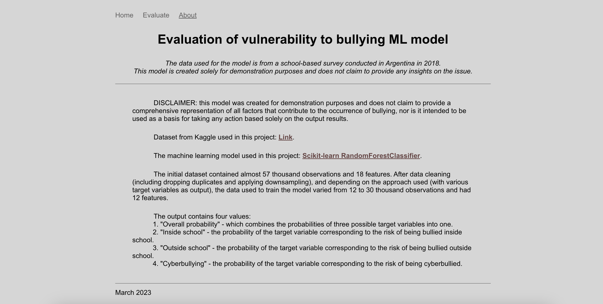
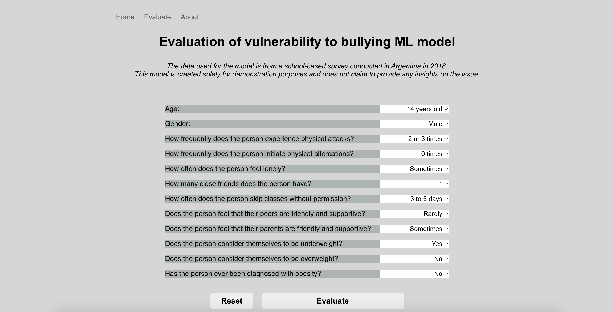
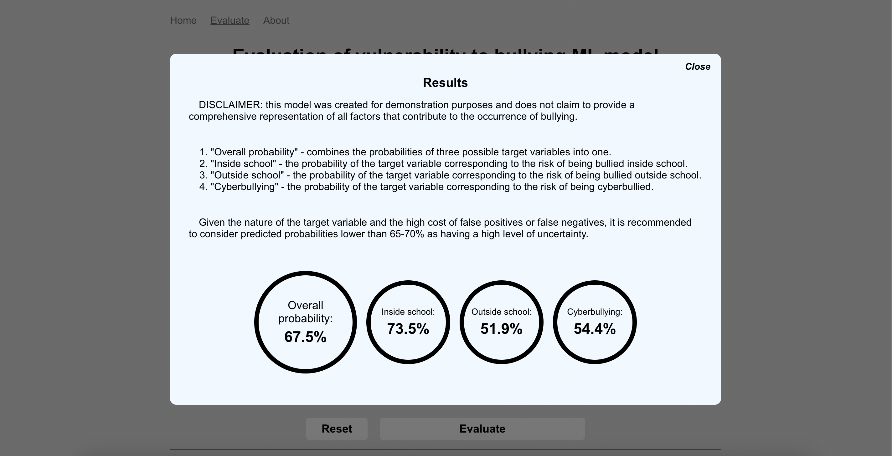
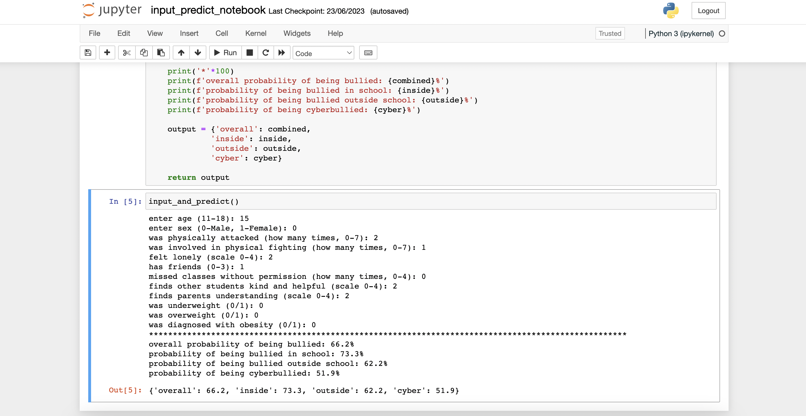

# Evaluation of Vulnerability to Bullying ML Model

_A random forest classifier model that attempts to evaluate vulnerability to bullying based on the data from a school-based survey conducted in Argentina in 2018._

_This model is created solely for demonstration purposes and does not claim to provide any insights on the issue._  

The repository contains both notebooks and a simple front-end/back-end for demonstration.

* To run locally see [instructions](#run-front-end-and-back-end-locally) below.

* To view the final notebook, which takes input and outputs predictions using saved models, open `input_predict_notebook.ipynb` from the ML folder with Jupyter Notebook or an IDE that supports a Jupyter Python kernel.
  
No additional configuration should be required when using a conda environment and a conda Python kernel.  

All files pertaining to the initial data set, data cleaning, and model creation can be found in the /ML folder of the repository:

* ML/data folder: initial data set, data sets created during data cleaning, input template;
* ML/data_cleaning folder: notebooks with the data cleaning process (divided into two steps);
* ML/models: notebooks with the model creation process (four models for different target variables);
* ML/models/saved_models: corresponding saved models for further usage in the back-end and final notebook;  

## Preview

* When running the project locally, you can view the home and about pages for information about the project:

* To test the model, switch to the evaluate tab, fill in the form, and click 'evaluate':

* After processing the inputs from the form using the Python script (model), a popup with the results will open:

* When viewing the project in `input_predict_notebook.ipynb`, restart the kernel and run all cells. The function in the last cell will prompt for input and output the results:

## Run front-end and back-end locally
At this time, front-end CSS is not adaptive and is designed for screens with a width of 1024px or more.  

__Note:__ Since some dependencies used, such as scikit-learn, may not be the latest version, it is recommended to set up a virtual environment __before__ installing dependencies from __step two__ below. 

To set up a virtual environment, open the terminal/bash, go to the root directory of the cloned repository, and follow these steps:
* mac: `$ python3 -m venv venv` / windows: `$ python -m venv venv`
* mac: `$ source venv/bin/activate` / windows: `$ source venv/Scripts/activate`
* upgrade pip by `$ python -m pip install --upgrade pip`
 
 

1. Clone the repository.
2. While in the root directory, install dependencies via the terminal:
    - `$ npm i` for back-end dependencies
    - `$ pip install -r requirements.txt` for python script (/backend/predict.py) dependencies
    - switch to /frontend directory and run `$ npm i` to install front-end dependencies
3. While in /frontend directory, launch the client by `$ npm run start`  
   The application will run on http://localhost:3000/ (should open automatically)
4. In another terminal window, while in /backend directory, launch the local server via the terminal by `$ npm run start`  
   The server will run locally at http://localhost:3001/

## Dataset
The [School-based survey in Argentina](https://www.kaggle.com/datasets/leomartinelli/bullying-in-schools) can be found on Kaggle.
